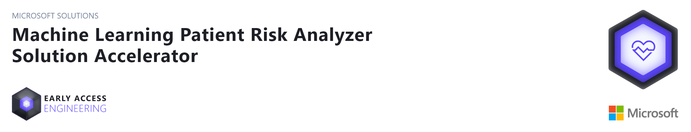
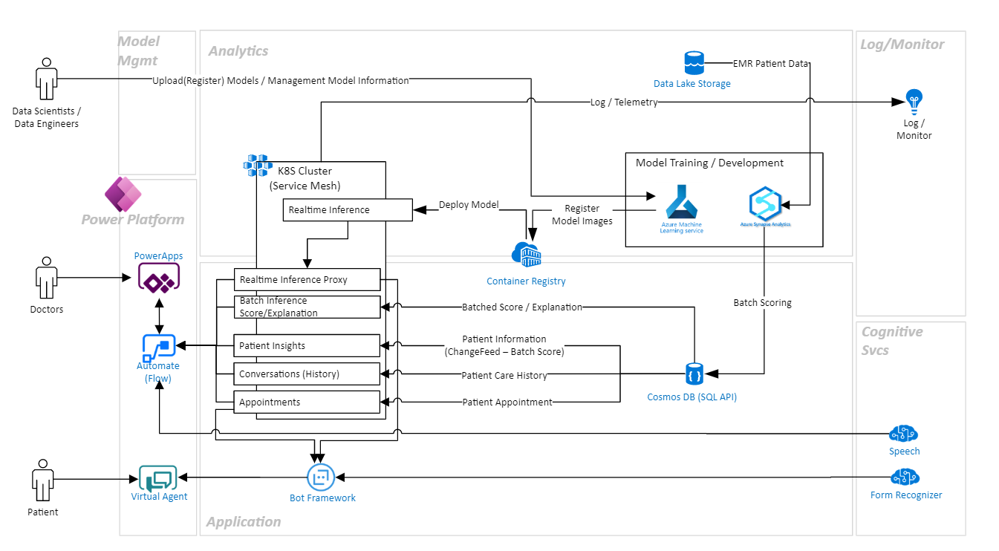

# About this repository 
Machine Learning Patient Risk Analyzer Solution Accelerator is an end-to-end (E2E) healthcare app that leverages ML prediction models (e.g., Diabetes Mellitus (DM) patient 30-day re-admission, breast cancer risk, etc.) to demonstrate how these models can provide key insights for both physicians and patients.  Patients can easily access their appointment and care history with infused cognitive services through a conversational interface.  
  
In addition to providing new insights for both doctors and patients, the app also provides the Data Scientist/IT Specialist with one-click experiences for registering and deploying a new or existing model to Azure Kubernetes Clusters, and best practices for maintaining these models through Azure MLOps.

## Prerequisites
In order to successfully complete this solution accelerator, you will need to have access to and/or provisioned the following resources:

1. Access to an [Azure Subscription ](http://portal.azure.com)
2. [Power Apps](http://www.powerapps.com) License (or free trial)
3. [PowerShell 7.1](https://docs.microsoft.com/en-us/powershell/scripting/install/installing-powershell?view=powershell-7.1)
4. [Azure CLI](https://docs.microsoft.com/en-us/cli/azure/install-azure-cli)
5. [Docker Desktop](https://hub.docker.com/editions/community/docker-ce-desktop-windows) - Required for Debugging in local or containerizing codes in the Deployment process

## Architecture Overview 
The architecture diagram below details what you will be building for this Solution Accelerator.

## Azure Development and Analytics Platforms 
The directions provided for this repository assume fundemental working knowledge of Azure, Azure Synapse Analytics, Azure Machine Learning and Azure Cognitive Services
1. [Azure Machine Learning](https://azure.microsoft.com/en-us/services/machine-learning/)
2. [Azure Synapse Analytics](https://azure.microsoft.com/en-us/services/synapse-analytics/)
3. [Azure Cognitive Service](https://azure.microsoft.com/en-us/services/cognitive-services/)
4. [Azure Kubernetes Service](https://azure.microsoft.com/en-us/services/kubernetes-service/)
5. [Azure Cosmos DB](https://azure.microsoft.com/en-us/services/cosmos-db)
6. [Power Apps](https://docs.microsoft.com/en-us/powerapps/)
7. [Power Virtual Agent](https://powervirtualagents.microsoft.com/)

## Getting Started
Start by deploying the [resources](./Resource_Deployment/ResourceDeployment.md) needed for this solution,

1. Press Deploy Azure :  

    

2. Clone repository and navigate to the root of the directory
3. Go to [Deployment Guide](./Resource_Deployment/DeploymentGuide.md) under [./Resource_Deployment](./ResourceDeployment) for the steps you need to take to deploy this solution

## Folders
## [Resource Deployment](./Resource_Deployment/README.md)
The resources in this folder can be used to deploy the required resources into your Azure Subscription. You can do this in the Azure Portal

## [Analytics Deployment](./Analytics_Deployment) 
This folder contains the Notebooks needed to complete this solution accelerator. Once you have deployed all the required resources from [Resource Deployment](./Resource_Deployment/README.md), run through the Notebooks following the instructions in Resource Deployment.

## [Backend Deployment](./Backend_Deployment) 
This folder contains all API services consumed via Power Automate.  
As Architecture diagram shows all of services will be compiled and deployed in Azure Kuebernetes service with [deployment script](./Backend_Deployment/deployapplications.ps1)

## [Frontend Deployment](./Frontend_Deployment) 
This folder contains Dialog based Patient User Interface Applications(Power Virtual Agent) and related services.

## DISCLAIMER
By accessing this code, you acknowledge that the code is not designed, intended, or made available: (1) as a medical device(s); (2) for the diagnosis of disease or other conditions, or in the cure, mitigation, treatment or prevention of a disease or other conditions; or (3) as a substitute for professional medical advice, diagnosis, treatment, or judgment. Do not use this code to replace, substitute, or provide professional medical advice, diagnosis, treatment, or judgement. You are solely responsible for ensuring the regulatory, legal, and/or contractual compliance of any use of the code, including obtaining any authorizations or consents, and any solution you choose to build that incorporates this code in whole or in part.

## Microsoft Open Source Code of Conduct

This project has adopted the [Microsoft Open Source Code of Conduct](https://opensource.microsoft.com/codeofconduct/).

Resources:

- [Microsoft Open Source Code of Conduct](https://opensource.microsoft.com/codeofconduct/)
- [Microsoft Code of Conduct FAQ](https://opensource.microsoft.com/codeofconduct/faq/)
- Contact [opencode@microsoft.com](mailto:opencode@microsoft.com) with questions or concerns

## License
Copyright (c) Microsoft Corporation

All rights reserved.

MIT License

Permission is hereby granted, free of charge, to any person obtaining a copy of this software and associated documentation files (the ""Software""), to deal in the Software without restriction, including without limitation the rights to use, copy, modify, merge, publish, distribute, sublicense, and/or sell copies of the Software, and to permit persons to whom the Software is furnished to do so, subject to the following conditions:

The above copyright notice and this permission notice shall be included in all copies or substantial portions of the Software.

THE SOFTWARE IS PROVIDED AS IS, WITHOUT WARRANTY OF ANY KIND, EXPRESS OR IMPLIED, INCLUDING BUT NOT LIMITED TO THE WARRANTIES OF MERCHANTABILITY, FITNESS FOR A PARTICULAR PURPOSE AND NONINFRINGEMENT. IN NO EVENT SHALL THE AUTHORS OR COPYRIGHT HOLDERS BE LIABLE FOR ANY CLAIM, DAMAGES OR OTHER LIABILITY, WHETHER IN AN ACTION OF CONTRACT, TORT OR OTHERWISE, ARISING FROM, OUT OF OR IN CONNECTION WITH THE SOFTWARE OR THE USE OR OTHER DEALINGS IN THE SOFTWARE

## Contributing

This project welcomes contributions and suggestions.  Most contributions require you to agree to a
Contributor License Agreement (CLA) declaring that you have the right to, and actually do, grant us
the rights to use your contribution. For details, visit https://cla.opensource.microsoft.com.

When you submit a pull request, a CLA bot will automatically determine whether you need to provide
a CLA and decorate the PR appropriately (e.g., status check, comment). Simply follow the instructions
provided by the bot. You will only need to do this once across all repos using our CLA.

This project has adopted the [Microsoft Open Source Code of Conduct](https://opensource.microsoft.com/codeofconduct/).
For more information see the [Code of Conduct FAQ](https://opensource.microsoft.com/codeofconduct/faq/) or
contact [opencode@microsoft.com](mailto:opencode@microsoft.com) with any additional questions or comments.

## Trademarks

This project may contain trademarks or logos for projects, products, or services. Authorized use of Microsoft 
trademarks or logos is subject to and must follow 
[Microsoft's Trademark & Brand Guidelines](https://www.microsoft.com/en-us/legal/intellectualproperty/trademarks/usage/general).
Use of Microsoft trademarks or logos in modified versions of this project must not cause confusion or imply Microsoft sponsorship.
Any use of third-party trademarks or logos are subject to those third-party's policies.
