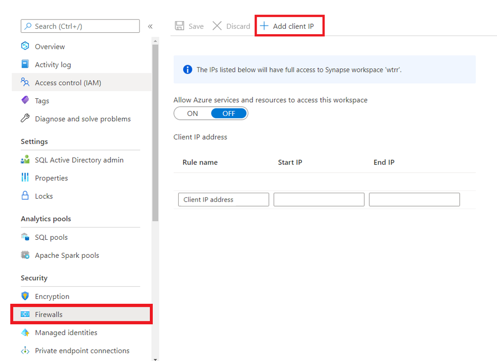
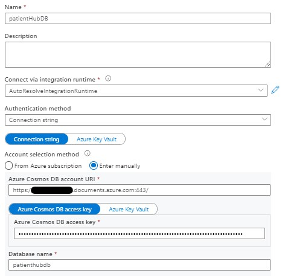
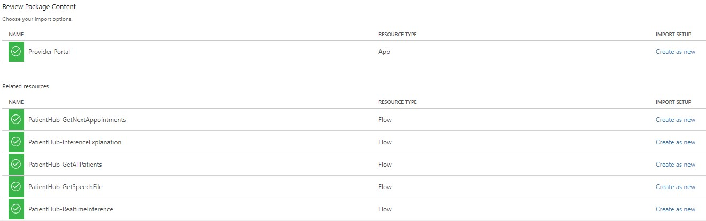
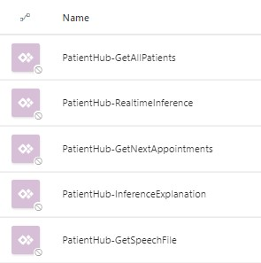

# Prerequisites
To use this solution accelerator, you will need access to an [Azure subscription](https://azure.microsoft.com/en-us/free/). While not required, a prior understanding of Azure Synapse Analytics, Azure Machine Learning, Azure Logic Apps, Power Apps and Azure Kubernetes Service will be helpful.

For additional training and support, please see:

1. [Azure Synapse Analytics](https://azure.microsoft.com/en-us/services/synapse-analytics/#overview)
2. [Azure Machine Learning](https://azure.microsoft.com/en-us/services/machine-learning/#product-overview)
3. [Azure Logic Apps](https://azure.microsoft.com/en-us/services/logic-apps/#overview)
4. [Power Apps](https://powerapps.microsoft.com/en-us/)
5. [Azure Kubernetes Service](https://azure.microsoft.com/en-us/services/kubernetes-service/#overview)

# Deployment Guide
Start by deploying the required resources to Azure. The button below will deploy Azure Synapse Analytics, Azure Machine Learning and its related resources, Azure Cosmos DB, Function App, Logic App, Speech Service, Translator and Azure Kubernetes Service.
  
## Step 1. Download Files
Clone or download this repository and navigate to the project's root directory.

More information on [Cloning a repository](https://github.com/microsoft/Machine-Learning-Patient-Risk-Analyzer-SA)

## Step 2: Get the Required Datasets
1. We are using the data provided by [UCI Machine Learning Repository](https://archive.ics.uci.edu/ml/datasets/Diabetes+130-US+hospitals+for+years+1999-2008#). You will need the following datasets (download them):
    * diabetic_data.csv

## Step 3. Upload Sample Dataset
### Step 3.1 Upload Sample Dataset to Azure Data Lake Storage
Upload the following files from the `/Analytics_Deployment/Data` folder into the ADLS storage account.
Create under the container `raw` a new folder `DatasetDiabetes`

- diabetic_data.csv
- Names.csv

### Step 3.2 Upload Sample Dataset to Azure Cosmos DB
Upload the following files from the `/Analytics_Deployment/Data` folder into the Cosmos DB.
Each file matches the name of the container.

- AdmissionSource.json
- Appointments.json
- ColumnLookupValues.json
- ColumnNameMap.json
- DischargeDisposition.json
- ICD9Code.json

You can use the [Data migration tool](https://docs.microsoft.com/en-us/azure/cosmos-db/import-data) or go to the Data Explorer of your Cosmos DB, select the container and click `Upload Item`

## Step 4. Update storage account permisions
In order to perform the necessary actions in Synapse workspace, you will need to grant more access.

1. Go to the Azure Data Lake Storage Account created above
2. Go to the `Access Control (IAM) > + Add > Add role assignment`
3. Now click the Role dropdown and select `Storage Blob Data Contributor`
    - Search for your username and add
4. Click `Save` at the bottom

## OPTIONAL - Step 4.1: Add IP Adress to the Synapse Workspace 
* **NOTE**: If you did not allow all connections during deployment of your resources, follow the steps below

Before you can upload any assets to the Synapse Workspace you will first need to add your IP address to the Synapse Workspace.
Before you can upload any assets to the Synapse Workspace you will first need to add your IP address to the Synapse Workspace. 
1. Go to the Azure Synaspe resource you created in Step 1.
2. Navigate to `Firewalls` under `Security` on the left hand side of the page. 
3. At the top click `+ Add client IP`

4. Your IP address should now be visable in the IP list.

## Step 5. Add Compute to Azure Machine Learning
1. Go to the Machine Learning Service and click the button `Launch Studio`
2. Click on `Compute` - select `Inference Clusters` and click `New`
3. Use an Existing Azure kubernetes cluster and select the kubernetes cluster that was created during the deploymnet of the resources
4. Click `Next`
5. Specify a Compute Name and click `Create`

## Step 6. Add the Cosmos DB as linked service
In this step you're going to add the Cosmos DB as a linked service in the Synapse Workspace.
1. Launch the Synapse workspace (via Azure portal > Synapse workspace > Workspace web URL) 
2. Click on `Manage - Linked Services - New`
3. Type in the search box "Cosmos" and select the service "Azure Cosmos DB (SQL API)"
4. Click `Continue`
5. Fill in the following data for the linked service

  | Field | Value |
  | ------------- | ------------- | 
  | Name | "patientHubDB" |
  | Connect via integration runtime | AutoResolveIntegrationRuntime |
  | Authentication method | Connection String |
  | Account selection method | Enter Manually |
  | Azure Cosmos DB account URI |Copy the Cosmos DB URI from the Cosmos DB you have created  |
  | Azure Cosmos DB access key | Copy the Cosmos DB Primary Key from the Cosmos DB you have created  |
  | Database name | "patienthubdb" |

## Step 7. Upload and run Notebooks
1. Launch the Synapse workspace (via Azure portal > Synapse workspace > Workspace web URL) 
2. Go to `Develop`, click the `+`, and click `Import` to select all Spark notebooks from the repository's `/Analytics_Deployment/Synapse-Workspace/Notebooks` folder
3. For each of the notebooks, select `Attach to > spark1` in the top dropdown
### 00_preparedata
1. Update `data_lake_account_name` variable to your ADLS in the [00_preparedata.ipynb](./Analytics_Deployment/Synapse-Workspace/Notebooks/00_preparedata.ipynb) notebook
2. Update `file_system_name` variable to your container in the [00_preparedata.ipynb](./Analytics_Deployment/Synapse-Workspace/Notebooks/00_preparedata.ipynb) notebook

### 01_train_diabetes_readmission_automl
1. Update `data_lake_account_name` variable to your ADLS in the [01_train_diabetes_readmission_automl.ipynb](./Analytics_Deployment/Synapse-Workspace/Notebooks/01_train_diabetes_readmission_automl.ipynb) notebook
2. Update `file_system_name` variable to your container in the [01_train_diabetes_readmission_automl.ipynb](./Analytics_Deployment/Synapse-Workspace/Notebooks/01_train_diabetes_readmission_automl.ipynb) notebook
3. Update `subscription_id` variable to your Azure SubscriptionID in the [01_train_diabetes_readmission_automl.ipynb](./Analytics_Deployment/Synapse-Workspace/Notebooks/01_train_diabetes_readmission_automl.ipynb) notebook
4. Update `resource_group` variable to your ResourceGroup in the [01_train_diabetes_readmission_automl.ipynb](./Analytics_Deployment/Synapse-Workspace/Notebooks/01_train_diabetes_readmission_automl.ipynb) notebook
5. Update `workspace_name` variable to your Azure Machine Learning Workspace in the [01_train_diabetes_readmission_automl.ipynb](./Analytics_Deployment/Synapse-Workspace/Notebooks/01_train_diabetes_readmission_automl.ipynb) notebook
6. Update `workspace_region` variable to your Azure Machine Learning Workspace Region in the [01_train_diabetes_readmission_automl.ipynb](./Analytics_Deployment/Synapse-Workspace/Notebooks/01_train_diabetes_readmission_automl.ipynb) notebook

### 02_deploy_AKS_diabetes_readmission_model
1. Update `data_lake_account_name` variable to your ADLS in the [02_deploy_AKS_diabetes_readmission_model.ipynb](./Analytics_Deployment/Synapse-Workspace/Notebooks/02_deploy_AKS_diabetes_readmission_model.ipynb) notebook
2. Update `file_system_name` variable to your container in the [02_deploy_AKS_diabetes_readmission_model.ipynb](./Analytics_Deployment/Synapse-Workspace/Notebooks/02_deploy_AKS_diabetes_readmission_model.ipynb) notebook
3. Update `subscription_id` variable to your Azure SubscriptionID in the [02_deploy_AKS_diabetes_readmission_model.ipynb](./Analytics_Deployment/Synapse-Workspace/Notebooks/02_deploy_AKS_diabetes_readmission_model.ipynb) notebook
4. Update `resource_group` variable to your ResourceGroup in the [02_deploy_AKS_diabetes_readmission_model.ipynb](./Analytics_Deployment/Synapse-Workspace/Notebooks/02_deploy_AKS_diabetes_readmission_model.ipynb) notebook
5. Update `workspace_name` variable to your Azure Machine Learning Workspace in the [02_deploy_AKS_diabetes_readmission_model.ipynb](./Analytics_Deployment/Synapse-Workspace/Notebooks/02_deploy_AKS_diabetes_readmission_model.ipynb) notebook
6. Update `workspace_region` variable to your Azure Machine Learning Workspace Region in the [02_deploy_AKS_diabetes_readmission_model.ipynb](./Analytics_Deployment/Synapse-Workspace/Notebooks/02_deploy_AKS_diabetes_readmission_model.ipynb) notebook
6. Update `autoMLRunId` variable to the Run ID that was returned in the 01_train_diabetes_readmission_automl notebook in the [02_deploy_AKS_diabetes_readmission_model.ipynb](./Analytics_Deployment/Synapse-Workspace/Notebooks/02_deploy_AKS_diabetes_readmission_model.ipynb) notebook
7. Update `aks_target_name` variable to the Compute you have created in step 5 in the [02_deploy_AKS_diabetes_readmission_model.ipynb](./Analytics_Deployment/Synapse-Workspace/Notebooks/02_deploy_AKS_diabetes_readmission_model.ipynb) notebook

When all the variables are modified, publish your all imported notebooks so they are saved in your workspace.
Run the following notebooks in order:
  - [00_preparedata](./Analytics_Deployment/Synapse-Workspace/Notebooks/00_preparedata.ipynb)
  - [01_train_diabetes_readmission_automl.ipynb](./Analytics_Deployment/Synapse-Workspace/Notebooks/01_train_diabetes_readmission_automl.ipynb)
  - [02_deploy_AKS_diabetes_readmission_model.ipynb](./Analytics_Deployment/Synapse-Workspace/Notebooks/02_deploy_AKS_diabetes_readmission_model.ipynb)

## Step 8. Deploy API service endpoints on the Azure Kubernetes Service
Before you can confiure the service endpoint, there are some Prerequisites that need to be installed on your device.

1.	[Azure CLI](https://docs.microsoft.com/en-us/cli/azure/install-azure-cli?view=azure-cli-latest)  - Required for the deployment and configuration of the Azure Resources and Source code
2.	[Docker Desktop](https://www.docker.com/get-started)  - Required for Debugging in local or containerizing codes in the Deployment process
3.	[PowerShell 7.x](https://github.com/PowerShell/PowerShell#get-powershell)  - Required to execute the Deployment Script

Open the [deployapplications.ps1](.\Backend_deployment\deployapplications.ps1) file and update the necesary variables.

| Field | Value |
  | ------------- | ------------- | 
  | $subscriptionId | SubscriptionID where Azure resources will be deployed |
  | $resourcegroupName | Resourcegroup Name where Azure resources will be deployed |
  | $containerRegistryName | Container Registry Name already deployed in previous deployment by Azure ML |
  | $kubernetesName | AKS Name already deployed in previous deployment by Azure ML |
  | $azurecosmosaccountName | Azure Cosmos DB Name already deployed in previous deployment |
  | $azurecosmosdbDataBaseName | "patientHubDB" |
  | $ttsSubscriptionKey | Azure Speech Service Subscription key in previous deployment |
  | $ttsServiceRegion | Azure Speech Service Service Region in previous deployment |
  | $mlServiceURL | Deployed Realtime inference service URL in Azure ML Studio in previous step |
  | $mlServiceBearerToken | Deployed Realtime infrence service BearerToken in Azure ML Studio in previous step |

Then run PowerShell `as Administrator` and launch the script [deployapplications.ps1](./Backend_Deployment/deployapplications.ps1)  

Once the script is finished, note down the public IP addresses for each services.  
You need them in the next step.

## Step 9. Run notebook 03_load_predictions
Go back to your Synapse workspace and open the notebook `03_load_predictions`
Fill in the variables:

1. Update `data_lake_account_name` variable to your ADLS in the [03_load_predictions.ipynb](./Analytics_Deployment/Synapse-Workspace/Notebooks/03_load_predictions.ipynb) notebook
2. Update `file_system_name` variable to your container in the [03_load_predictions.ipynb](./Analytics_Deployment/Synapse-Workspace/Notebooks/03_load_predictions.ipynb) notebook
3. Update `subscription_id` variable to your Azure SubscriptionID in the [03_load_predictions.ipynb](./Analytics_Deployment/Synapse-Workspace/Notebooks/03_load_predictions.ipynb) notebook
4. Update `resource_group` variable to your ResourceGroup in the [03_load_predictions.ipynb](./Analytics_Deployment/Synapse-Workspace/Notebooks/03_load_predictions.ipynb) notebook
5. Update `workspace_name` variable to your Azure Machine Learning Workspace in the [03_load_predictions.ipynb](./Analytics_Deployment/Synapse-Workspace/Notebooks/03_load_predictions.ipynb) notebook
6. Update `workspace_region` variable to your Azure Machine Learning Workspace Region in the [03_load_predictions.ipynb](./Analytics_Deployment/Synapse-Workspace/Notebooks/03_load_predictions.ipynb) notebook

When all the variables are modified, publish your the notebook so it is saved in your workspace, and run it.

## Step 10. Deploy and configure the Provider Portal App
1. Go to https://make.preview.powerapps.com/
2. In the right upper corner, make sure you select the correct environment where you want to deploy the Power App.
3. Click on `Apps - Import Canvas App`
4. Click upload and select the [Frontend_Deployment/PatientHubDoctorPortal.zip](./Frontend_Deployment/PatientHubDoctorPortal.zip) Zipfile.
5. Review the package content. You should see the details as the screenshot below

  

6. Under the `Review Package Content`, click on the little wrench next to the Application Name `Provider Portal`, to change the name of the Application. Make sure the name is unique for the environemnt.
7. Click Import and wait until you see the message `All package resources were successfully imported.`
8. Click on `Flows`. You will notice that all the flows are disabled. 

9. You need to turn them on before you can use them. Hover over each of the flows, select the button `More Commands` and click `Turn on`.

10. For each flow, you need to change the HTTP component so that the URI points to your API Services. Edit each flow, open the HTTP component and past the Public IP addresses you noted down in the previous step.
Your URI should look similar like the screenshot below.

| API Service | Flow |
  | ------------- | :------------- | 
  | appointment | PatientHub-GetNextAppointments |
  | batchinference | PatientHub-InferenceExplanation |
  | patient | PatientHub-GetAllPatients | 
  | realtimeinference | PatientHub-RealtimeInference |
  | tts | PatientHub-GetSpeechFile |  

11. After the modification, click the "Test" button in the upper right corner to test the flow. If all went well, you should receive "Your flow ran successfully".
12. Once the flows are modified, you should open the Power App and all should work like a charm.

<!-- ## Step 11. Deploy and configure the Chat Bot -->

## DISCLAIMER
By accessing this code, you acknowledge that the code is not designed, intended, or made available: (1) as a medical device(s); (2) for the diagnosis of disease or other conditions, or in the cure, mitigation, treatment or prevention of a disease or other conditions; or (3) as a substitute for professional medical advice, diagnosis, treatment, or judgment. Do not use this code to replace, substitute, or provide professional medical advice, diagnosis, treatment, or judgement. You are solely responsible for ensuring the regulatory, legal, and/or contractual compliance of any use of the code, including obtaining any authorizations or consents, and any solution you choose to build that incorporates this code in whole or in part.
